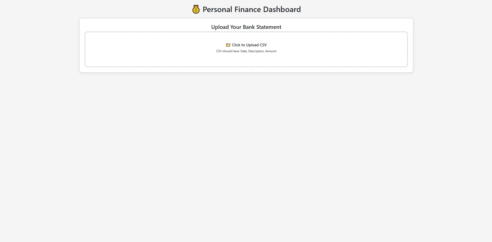
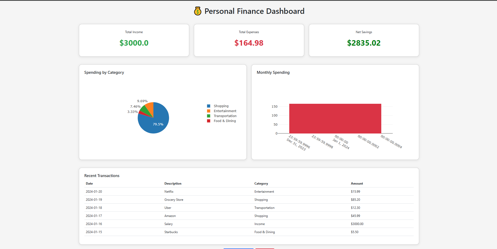

# 💰 Personal Finance Dashboard

A full-stack Python web application for tracking and visualizing personal finances. Upload bank statements, automatically categorize transactions, and gain insights through interactive charts.


## 🌟 Features

- **CSV Upload**: Import bank statements with automatic column detection
- **Smart Categorization**: Automatic transaction categorization (Food, Shopping, Transportation, etc.)
- **Interactive Charts**: 
  - Spending breakdown by category (pie chart)
  - Monthly spending trends (bar chart)
- **Financial Summary**: Track income, expenses, and net savings
- **Recent Transactions**: View latest transactions with categories
- **Data Management**: Simple interface to upload or clear data

## 🎯 Demo

### What You'll See
- Real-time spending analytics
- Visual breakdown of where your money goes
- Monthly spending patterns
- Complete transaction history

## 📋 Prerequisites

- Python 3.8 or higher
- pip (comes with Python)

## 🚀 Quick Start

### 1. Clone or Download This Project

```bash
git clone https://github.com/yourusername/personal-finance-dashboard.git
cd personal-finance-dashboard
```

### 2. Install Dependencies

```bash
pip install flask pandas
```

### 3. Run the Application

```bash
python app.py
```

### 4. Open Your Browser

Go to: `http://localhost:5000`

## 📊 CSV Format

Your bank statement CSV should include these columns:
- **Date**: Any standard format (2024-01-15, 01/15/2024)
- **Description**: Transaction description or merchant name
- **Amount**: Negative for expenses, positive for income

### Example CSV:
```csv
Date,Description,Amount
2024-01-15,Starbucks Coffee,-5.50
2024-01-16,Salary Deposit,3000.00
2024-01-17,Amazon Purchase,-45.99
2024-01-18,Uber Ride,-12.30
2024-01-19,Walmart,-85.20
```

## 📁 Project Structure

```
personal-finance-dashboard/
├── app.py                 # Main Flask application
├── requirements.txt       # Python dependencies
├── README.md             # Documentation
├── sample_data.csv       # Example data
├── uploads/              # Temporary upload folder
└── finance.db            # SQLite database (auto-created)
└── img/                  # Screenshots and charts
```

## 🎨 Categories

Transactions are automatically categorized into:
- **Income**: Salary, deposits
- **Food & Dining**: Restaurants, cafes, groceries
- **Shopping**: Retail stores, online shopping
- **Transportation**: Uber, gas, parking
- **Entertainment**: Netflix, movies, games
- **Bills & Utilities**: Phone, internet, electricity
- **Other**: Everything else

## 🔧 Customization

### Add New Categories

Edit the `categorize_transaction()` function in `app.py`:

```python
if any(word in description for word in ['gym', 'fitness', 'yoga']):
    return 'Health & Fitness'
```

### Change Port

Modify the last line in `app.py`:

```python
app.run(debug=True, port=5001)  # Change from 5000 to 5001
```

## 🛠️ Technologies Used

- **Backend**: Flask (Python web framework)
- **Data Processing**: Pandas
- **Database**: SQLite
- **Frontend**: Bootstrap 5
- **Charts**: Plotly.js

## 📸 Screenshots





## ❗ Troubleshooting

### "Module not found" Error
```bash
pip install flask pandas
```

### Port Already in Use
Change the port in `app.py` from 5000 to 5001

### CSV Upload Fails
- Check that CSV has Date, Description, and Amount columns
- Ensure amounts are numbers (not text)
- Remove any extra header rows

## 🤝 Contributing

This is a portfolio project, but suggestions are welcome!

## 📝 License

This project is open source and available under the MIT License.

## 👤 Author

**Your Name**
- GitHub: [@imransadiq-hub](https://github.com/imransadiq-hub)
- LinkedIn: [Imran Sadiq](https://www.linkedin.com/in/noralimransadiq/)
- Email: imransadiq75@gmail.com

## 🎯 Skills Demonstrated

This project showcases:
- Full-stack web development with Flask
- Data processing and analysis with Pandas
- Database design and management (SQLite)
- Front-end development (HTML/CSS/JavaScript)
- Data visualization with Plotly
- File upload handling
- RESTful routing
- Python best practices

---

⭐ If you find this project useful, please give it a star!